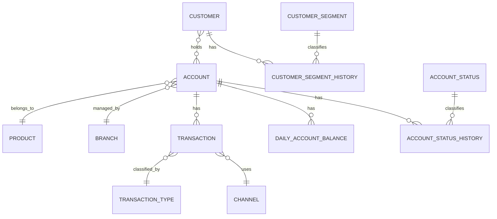

# Conceptual Model Diagram

This diagram shows the high-level business entities and relationships for the banking capstone project.

The conceptual model focuses on business meaning, not database implementation.

## Conceptual ERD



## Main relationships

```text
Customer many-to-many Account
Account many-to-one Product
Account many-to-one Branch
Account one-to-many Transaction
Transaction many-to-one Transaction Type
Transaction many-to-one Channel
Account one-to-many Daily Account Balance
Customer one-to-many Customer Segment History
Customer Segment one-to-many Customer Segment History
Account one-to-many Account Status History
Account Status one-to-many Account Status History
```

## Important conceptual decision

The relationship between `Customer` and `Account` is many-to-many.

This is because:

```text
One customer can hold many accounts.
One account can be held by many customers.
```

In the logical model, this relationship is resolved using:

```text
Account Holder
```

## Business cautions

### Joint accounts

Transactions belong to accounts, not directly to customers.

If a transaction is joined to multiple account holders, the amount can be double-counted.

Customer-level transaction reporting needs a clear allocation or attribution rule.

### Transactions vs balances

Transactions are events.

Balances are snapshots.

They should be modelled separately.

### History

Customer segment and account status can change over time.

The model includes history entities so that historical reporting can remain accurate.
