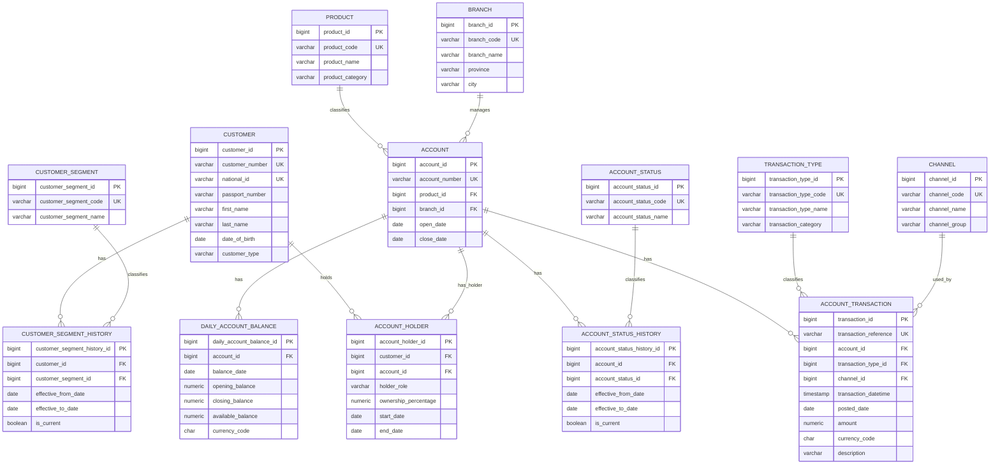

# Logical Model Diagram

This diagram shows the logical data model for the banking capstone project.

The logical model converts the conceptual business model into structured tables, keys, and relationships.

## Logical ERD



## Table grains

```text
customer:
One row per customer.

customer_segment:
One row per customer segment.

customer_segment_history:
One row per customer segment assignment for a time period.

product:
One row per banking product.

branch:
One row per branch.

account:
One row per bank account.

account_status:
One row per account status.

account_status_history:
One row per account status assignment for a time period.

account_holder:
One row per customer-account relationship.

channel:
One row per transaction channel.

transaction_type:
One row per transaction type.

account_transaction:
One row per posted account transaction.

daily_account_balance:
One row per account per day.
```

## Main many-to-many relationship

The many-to-many relationship is:

```text
Customer many-to-many Account
```

Resolved by:

```text
account_holder
```

Expanded:

```text
customer 1 --- many account_holder
account  1 --- many account_holder
```

## Important design notes

### Account holder

`account_holder` is not just a technical bridge.

It stores business meaning about the customer-account relationship:

```text
holder_role
ownership_percentage
start_date
end_date
```

### Transaction grain

`account_transaction` stays at account grain.

It does not directly store `customer_id`.

This avoids accidental double-counting in joint account scenarios.

### Balance grain

`daily_account_balance` is separate from `account_transaction`.

A transaction is an event.

A balance is a daily snapshot.

### History

Customer segment and account status are historised through:

```text
customer_segment_history
account_status_history
```

This protects historical reporting.
