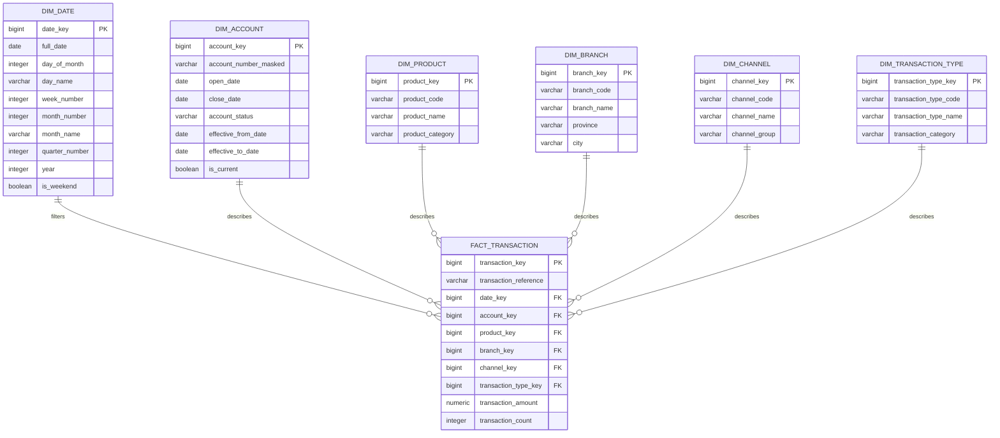
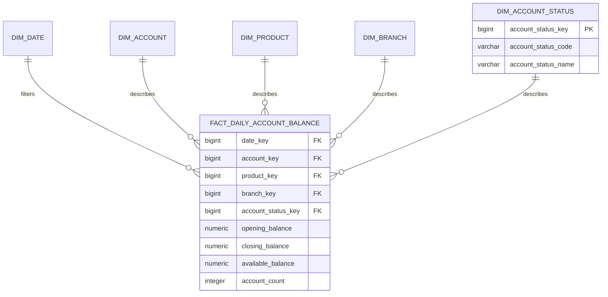
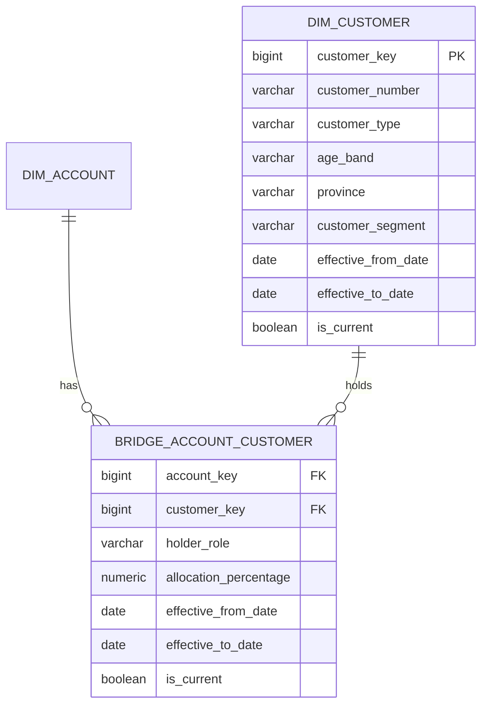

# Star Schema Diagram

This diagram shows the analytics star schema for the banking capstone project.

The star schema is designed for reporting, dashboards, and business analysis.

## Transaction star schema



## Daily balance star schema



## Customer bridge for joint accounts



## Fact table grains

```text
fact_transaction:
One row per posted account transaction.

fact_daily_account_balance:
One row per account per day.
```

## Measures

```text
fact_transaction.transaction_amount:
Additive.

fact_transaction.transaction_count:
Additive.

fact_daily_account_balance.opening_balance:
Semi-additive.

fact_daily_account_balance.closing_balance:
Semi-additive.

fact_daily_account_balance.available_balance:
Semi-additive.

fact_daily_account_balance.account_count:
Semi-additive.
```

## Important reporting warning

Transactions belong to accounts.

Customers and accounts have a many-to-many relationship.

Because of this, customer-level transaction reporting must use a clear rule.

Possible rules:

```text
Report at account level only.
Assign transaction value to the primary holder.
Allocate transaction value by ownership percentage.
Allocate transaction value equally across account holders.
```

Without a rule, joining transactions to customers through account holders can double-count transaction amounts.

## Example path for account-level transaction reporting

```text
fact_transaction
    → dim_date
    → dim_account
    → dim_product
    → dim_branch
    → dim_channel
    → dim_transaction_type
```

## Example path for customer-level transaction reporting

```text
fact_transaction
    → dim_account
    → bridge_account_customer
    → dim_customer
```

Use allocation logic when summing transaction values by customer.

## Key takeaway

The star schema separates business events and snapshots into different fact tables:

```text
fact_transaction
fact_daily_account_balance
```

It uses dimensions to make reporting easier:

```text
dim_date
dim_account
dim_product
dim_branch
dim_channel
dim_transaction_type
dim_customer
```

It uses a bridge table to handle joint account reporting:

```text
bridge_account_customer
```
